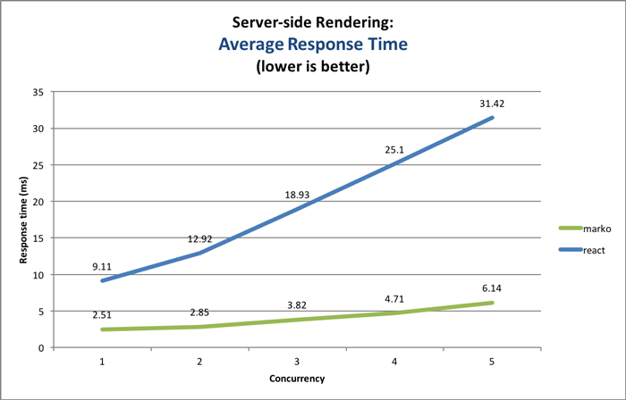
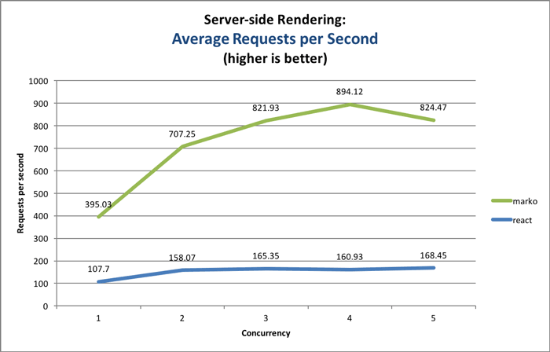
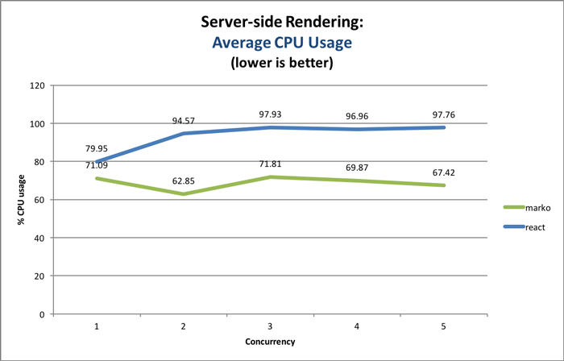
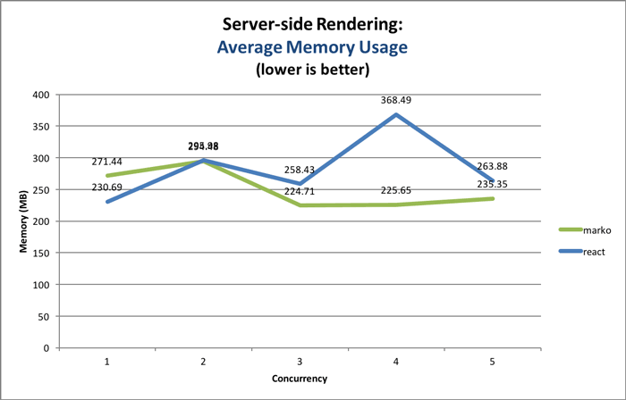

> __DEPRECATED - Please see the following benchmark that is actively maintained:__ https://github.com/marko-js/isomorphic-ui-benchmarks

Marko vs React: Performance Benchmark
========================================

_NOTE: This comparison was updated on January 5, 2016 to use `react@15.3.2` and `marko@4.0.0-beta.10`._

The goal of this project is to provide a _real-world_ sample app that can be used to compare the performance of two different approaches of building UI component-centric, [_isomorphic_](http://nerds.airbnb.com/isomorphic-javascript-future-web-apps/) web applications:

1. [Marko](https://github.com/marko-js/marko): UI components building library. Marko uses [morphdom](https://github.com/patrick-steele-idem/morphdom) internally to diff/patch the DOM.
1. [React](http://facebook.github.io/react/): UI components built using JSX and rendered to the DOM using a virtual DOM with a diffing algorithm to minimize updates. UI components must be rendered on the client for behavior to be attached.

We are interested in the following metrics for comparing the performance of Marko and React:

- For rendering pages on the server under varying load:
    - HTTP response time
    - Requests per second
    - CPU usage
    - Memory usage
- Performance when rendering UI components on the client
- Time needed before the initial page is fully ready on the client
- Page weight (amount of HTML and JS code)

# Disclaimer

While I, [Patrick Steele-Idem](https://github.com/patrick-steele-idem), am the author of [Marko](https://github.com/raptorjs/marko), every effort was made to be fair and unbiased when putting together this comparison. I've also asked other developers to review this benchmark. If you find a problem please open a Github issue to discuss.

Both Marko and React have a lot of merit when it comes to building webapps based on UI components, and I was genuinely curious to see how they performed in practice. Both React and Marko a DOM diffing/patching algorithm to update the view. However, React makes use of a virtual DOM while Marko only utilizes the real DOM. Marko uses the [morphdom](https://github.com/patrick-steele-idem/morphdom) module to update the DOM with the minimum number of changes

Also, this benchmark focuses on both server-side and client-side rendering performance. Many apps benefit from rendering the initial page on the server since it supports SEO and it often reduces the time to render the initial page. Both React and Marko support rendering on both the server and in the browser.

# Test Setup Overview

To compare performance, both React and Marko were used to build a page that displays search results consisting of _100_ search results items using eBay listings as sample data. Each search results item is rendered into a `<div>` with the following information:

- Image
- Title
- Price
- "Buy Now" button (for testing behavior)

The initial page of search results is rendered on the server and the app allows additional pages of search results to be rendered completely on the client.

To test server-side rendering performance, the [http-stats](https://www.npmjs.com/package/http-stats) tool is used to put the server under increasing load while collecting statistics. A freshly started server is used to test Marko and React independently.

To test client-side rendering performance, a simple script is used to cycle through 100 pages of sample search results data (100 search items per page).  After each page is rendered and after the resulted are flushed to the DOM, the next page of search results is rendered until the test completes. The total time used to complete the test is used to measure the performance of client-side rendering.

# Running the Tests

The following commands should be used to benchmark server-side rendering performance:

```
git clone https://github.com/patrick-steele-idem/marko-vs-react.git
cd marko-vs-react
npm install
npm test
```

_NOTE: The server will automatically be started with `NODE_ENV=production`_

The following steps should be used to benchmark client-side rendering performance:

```
NODE_ENV=production node server.js
```

And then launch a web browser and load the following pages:

- [http://localhost:8080/react](http://localhost:8080/react)
- [http://localhost:8080/marko](http://localhost:8080/marko)

On each page, click on the button at the top labeled "Start Client Performance Tests". The results of the test will be shown at the top of the page.

# Results

The test setup is described in more detail later in this document, but below are the results of running the tests with the following configuration:

- MacBook Pro (2.8 GHz Intel Core i7, 16 GB 1600 MHz DDR3)
- Server-side:
    - Node.js: v7.3.0
- Client-side:
    - (see versions below)

## Results Summary

On the server, Marko was the winner by far. On the client, React and Marko performed nearly the same. However, on an iPhone 6 running iOS 8.4, Marko performed significantly better.

On the server, Marko was able to render the page much more quickly and with much lower CPU and memory usage. These benchmarks indicate that React needs to go through a lot more optimization before it is ready to be used on the server.

It is also worth pointing out that React also suffers from a severe disadvantage in  that a page rendered on the server must be re-rendered on the client in order for behavior to be bound to UI components. When the re-rendering happens on the client, the exact same input data needs to be provided to the top-level UI component. For this benchmark, this means that the data used to render the initial pages of search results needed to be serialized to JSON and included in the output HTML rendered on the server. Even while temporarily disabling the serialization of JSON it was still observed that React was significantly slower doing server-side rendering.

On the client, Marko and React were able to cycle through pages of search results in about the same time. The performance gap between Marko and React will likely vary by use case and will be sensitive to the DOM structure.

Finally, a web page that uses React will have a significantly higher weight due to the size of the React JavaScript library, as well as the addition of React-specific `data-*` attributes (e.g., `data-reactid=".t9c80npc00.1.$1.1"`) that are added to the output HTML during rendering. The page weight also increased due to the embedding of the extra JSON required to re-render the initial page on the client (discussed earlier).


## Server-side Rendering Performance









## Client-side Rendering Performance

Time taken to cycle through 100 pages of search results (100 search results items per page):

### Chrome

```
marko x 259 ops/sec ±1.22% (59 runs sampled)
react x 220 ops/sec ±1.09% (56 runs sampled)
Fastest is marko
```

_NOTE: Version 55.0.2883.95 (64-bit)_

### Firefox

```
marko x 187 ops/sec ±1.80% (50 runs sampled)
react x 126 ops/sec ±2.15% (52 runs sampled)
Fastest is marko
```

_NOTE: v50.1.0_

### Safari

```
marko x 465 ops/sec ±1.50% (60 runs sampled)
react x 271 ops/sec ±1.69% (53 runs sampled)
Fastest is marko
```

_NOTE: Version 10.0.1 (11602.2.14.0.7)_

### iOS Mobile Safari

```
marko x 108 ops/sec ±2.60% (48 runs sampled)
react x 68.33 ops/sec ±1.65% (47 runs sampled)
Fastest is marko
```

_NOTE: iPhone 6 with iOS 10.2_

## Page Weight

### JavaScript Page Weight

```
[marko]
  gzip:  11,747 bytes
   min:  32,199 bytes

[react]
  gzip:  43,005 bytes
   min: 134,459 bytes
```

Source: [marko-js/marko/benchmark/size](https://github.com/marko-js/marko/tree/master/benchmark/size)

### HTML Page Weight

<table>
    <thead>
        <tr>
            <td></td>
            <td>Uncompressed</td>
            <td>Gzipped</td>
            <td></td>
        </tr>
    </thead>
    <tbody>
        <tr>
            <td>Marko</td>
            <td align="right">47.2 KB</td>
            <td align="right">7.7 KB</td>
            <td>✔</td>
        </tr>
        <tr>
            <td>React</td>
            <td align="right">64.3 KB</td>
            <td align="right">12.1 KB</td>
            <td>✖</td>
        </tr>
    </tbody>
</table>

The output HTML can be compared using the links below:

- [Marko output HTML](test/generated/html-marko.html)
- [React output HTML](test/generated/html-react.html)

# Test Setup Details

The entry point for the Node.js app that starts the server is [server.js](server.js). The main script creates an Express app with the following routes:

1. `/marko` - Renders the search results page using Marko.<br>Maps to the following controller: [src/marko/pages/search-results/index.js](src/marko/pages/search-results/index.js)
2. `/react` - Renders the search results page using React.<br>Maps to the following controller: [src/react/pages/search-results/index.jsx](src/react/pages/search-results/index.jsx)
3. `/static` - Used to serve up static JS resources
4. `/` - Serves up the index page

The code is divided into the following directories:

- [/src/marko](/src/marko) - All UI components and page code that is specific to Marko
- [/src/react](/src/react) - All UI components and page code that is specific to React
- [/src/shared](/src/shared) - All code that is shared across Marko and React

For both React and Marko, Marko templates is used to render the page skeleton and the [Lasso.js](https://github.com/lasso-js/lasso) tool is used to deliver all of the required JavaScript code to the browser.

On both the server and the client, the `NODE_ENV` variable is set to `production` since React behaves differently in non-production mode.

## Marko

For Marko, the [main page template](src/marko/pages/search-results/template.marko) includes a custom tag that delegates rendering of the body of the page to the [`<app-search-results>`](src/marko/components/app-search-results) UI component:

```html
<app-search-results search-results-data=searchResultsData/>
```

The template for the [`<app-search-results>`](src/marko/components/app-search-results) component is shown below:

```html
<script>
    var measurePageCycling = require('~/src/shared/util/measurePageCycling');

    module.exports = {
        getTemplateData: function(state, input) {
            return input.searchResultsData;
        },

        handleStartButtonClick: function() {
            var self = this;
            var searchResultsData;

            // Start cycling through search result pages and update the DOM
            // after receiving each search results page
            measurePageCycling(
                function updateDOM(newSearchResultsData, done) {
                    searchResultsData = newSearchResultsData;
                    self.setProps({
                        searchResultsData: searchResultsData
                    });
                    self.update();
                    done();
                });
        }
    };
</script>
<div class="search-results">
    <button type="button" onClick("handleStartButtonClick")>
        Start Client Performance Tests
    </button>
    <div>
        <!-- Loop over the search results items: -->
        <app-search-results-item item-data=item
            for(i, item in data.items)
            ref="item-${i}"/>
    </div>
    <app-footer/>
</div>
```

The template for the [`<app-search-results-tem>`](src/marko/components/app-search-results-item) component is shown below:

```html
<script>
    module.exports = {
        handleBuyButtonClick: function() {
            this.el.style.backgroundColor = 'yellow';
        }
    };
</script>

var itemData=data.itemData

<div class="search-results-item">
    <h2>${itemData.title}</h2>
    
    <span>${itemData.price}</span>
    <button type="button" onClick("handleBuyButtonClick")>Buy now!</button>
</div>
```

During rendering of the Marko templates, Marko keeps track of all the rendered widgets (including the HTML element that they are bound to). This information is passed to the client as part of the DOM so that the widgets can efficiently be initialized when the page loads. If a UI component is rendered on the client, the list of rendered widgets is kept in memory and after the resulting HTML is added to the DOM all of the rendered widgets are then initialized.

## React

For React, code similar to the following is used to produce the body HTML for the page:

```javascript
var React = require('react');
var SearchResults = require('src/react/components/SearchResults');
var searchResultsHTML = React.renderToString(
        <SearchResults searchResultsData={searchResultsData}/>);
```

The `render` method for the [`SearchResults`](src/react/components/SearchResults.jsx) UI component contains the following code:

```javascript
function render() {
      var searchResultsData = this.state.searchResultsData;

      return (
          <div className="search-results">
              <button type="button" onClick={this.handleStartButtonClick}>
                  Start Client Performance Tests
              </button>
              <div>
              {searchResultsData.items.map(function(item) {
                  return <SearchResultsItem key={item.id} itemData={item}/>
              })}
              </div>
          </div>
      );
}
```

For behavior to be attached on the client, the page must be re-rendered on the client using the same search results data. Therefore, the React testbed also includes additional code to serialize the search results data to JSON. The resulting JSON data is dropped into the page inside a `<script>` block that introduces a new global variable.

The re-rendering of the initial page on the client is done in [src/react/pages/search-results/client.jsx](src/react/pages/search-results/client.jsx) using the following code:

```javascript
var React = require('react');
var ReactDOM = require('react-dom');

var SearchResults = require('src/react/components/SearchResults');

var mountNode = document.getElementById("searchResultsMount");

ReactDOM.render(
    <SearchResults searchResultsData={window.searchResultsData}/>,
    mountNode);
```

Related code:

- React page controller: [src/react/pages/search-results/index.jsx](src/react/pages/search-results/index.jsx)
- React page template: [src/react/pages/search-results/template.marko](src/react/pages/search-results/template.marko)
- Client-side entry point: [src/react/pages/search-results/client.jsx](src/react/pages/search-results/client.jsx)
- React UI components:
    - [SearchResults.jsx](src/react/components/SearchResults.jsx)
    - [SearchResultsItem.jsx](src/react/components/SearchResultsItem.jsx)

# Final Thoughts

It's important to emphasize that this benchmark is only comparing one specific use case: rendering a page of search results. The numbers gathered here suggest that there is significant overhead when using React on the server. On the client, React has the performance advantage at runtime but the gap is much smaller. However, React requires a much large amount of JavaScript to be downloaded and executed.

# Raw Data

If you are interested in the raw data, much of the data can be found in the following directory:

[test/generated/](test/generated)

# Contributions and Feedback

If you see any problems or have any suggestions please let us know. Every effort was made to be as fair and accurate as possible, but mistakes do happen. If you find a problem please open a Github issue to discuss.
